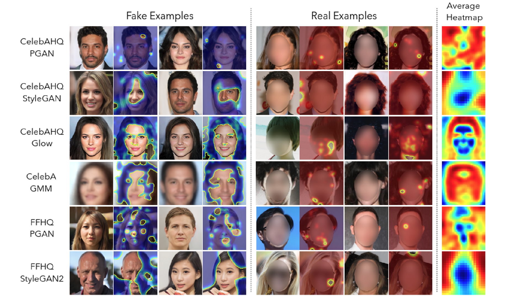
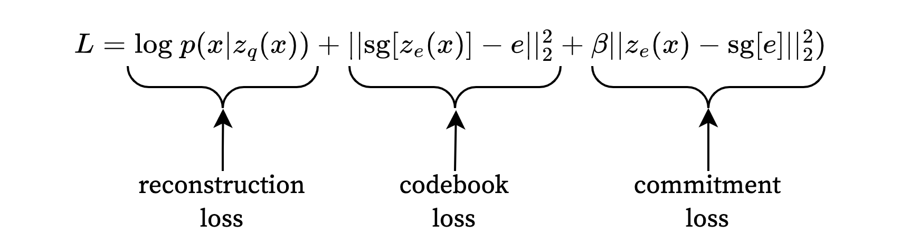

# Deepfake CSI: VQ-VAE and Autoregressive Sleuths on the Case

## Introduction

With rapid improvements in generative AI, it is becoming more difficult to distinguish real from generated data. One of the most notable examples is found in generative image models. These generative models can be easily abused to mislead, impersonate, or defame people (e.g.: Xue et al., 2019). Therefore, the need for technology that can distinguish generated images from real images has become a critical area of research. This problem can be posed as an anomaly detection task, with the goal of identifying artifacts that typically occur in modified or generated images but not in real ones. Marimont & Tarroni (2021) recently introduced an anomaly detection model yielding promising results in the field of medical imaging. In this blog post, we will investigate the performance of this model for the purpose of detecting generated and artificially altered images of faces, or *fakes*. First, we will discuss the methodology used by Marimont & Tarroni (2021). Then we will explain how this method is applied to distinguishing modified faces from real faces. Finally, we present the results of this method on various datasets and evaluate its robustness to different face manipulation techniques.
 
### Anomaly Detection through Latent Space Restoration using Vector Quantized Variational Auto-Encoders

In response to the 2020 Medical Out of Distribution (MOOD) challenge, Marimont & Tarroni (2021) developed a novel method for detecting anomalies in image data. A Vector-Quantized Variational Auto-Encoder (VQ-VAE), as introduced by van den Oord et al. (2017), was trained on two datasets of medical images; MRI scans of full brain volumes, and abdominal CT scans. The main characteristic of the VQ-VAE architecture is the latent space: in a regular VAE, the latent space is typically continuous, whereas the VQ-VAE architecture employs a discrete one. The technical details and (dis)-advantages of using VQ-VAEs will be discussed in Methods. The latent space of the VQ-VAE is regularized by a learned autoregressive prior using the PixelSNAIL architecture (Chen et al., 2018). This architecture allows the calculation of both sample and pixel-wise anomaly scores, indicating predictions for the likelihood of a scan containing an anomaly and the likelihood of a pixel being anomalous. Since the MOOD challenge test data is withheld, the model was evaluated using a small toy dataset with clear artificial anomalies (Figure 1). On this toy dataset, the VQ-VAE outperformed a regular VAE model in detecting anomalies on the sample and pixel levels.

    
    
<i>Figure 1: Example of a slice containing an artificial anomaly.</i>

The model performed well on the withheld test data, resulting in the best AE-based performance and the second-best performance of overall (Zimmerer et al., 2020). However, it was noted that performance is especially high for obvious abnormal inputs (e.g., containing large hyperintense patches originating from a tumor), while performance on images with more subtle anomalies is much less stable, limiting the practical use of these models. Furthermore, performance was not consistent between datasets. The MRI brain scan dataset was obtained from healthy young individuals, meaning that the brains are quite uniform between subjects. The other dataset consisting of abdominal CT scans, however, was obtained from both healthy and unhealthy participants of varying age groups. Additionally, more variance is expected here since multiple organs are contained within the abdomen. Performance seems sensitive to this variance since the model performed much better on the MRI dataset than on the high-variance dataset containing healthy and unhealthy abdominal CT scans (Marimont \& Tarroni, 2021; Zimmerer et al., 2020). It is unclear whether this results from an inherent limitation of this model or whether this could be resolved with more data.

## Anomaly Detection in Fake Image Recognition

The increase in the number of automatic facial recognition systems (Kortli et al., 2020; Tolba et al., 2006) stimulated the development of different techniques to fool such models (e.g. Parmar et al., 2022; Xue et a., 2019). Several techniques, including VAE-based models, have been developed to detect manipulated faces with some success. However, VQ-VAE models have not yet been applied to this task. These models are relatively cheap to train, can explain their classification decisions using residuals, and have been shown to outperform regular VAEs in anomaly detection (Marimont & Tarroni, 2021). We will evaluate VQ-VAE based anomaly detection applied to morphed faces.

Our contribution can be split into three parts, since the results have implications for both the field of medical anomaly detection and fake face detection:

- Our results investigate whether the model can perform well on high-variance data (such as images of faces) when larger datasets are available.
- Obtained results will show whether this approach can be used for detecting manipulated faces in an effort to support the development of the models which are able to do so.
- We improved the training time of the code written by Marimont & Tarroni (2021) by making improvements in the data preprocessing pipelines.

## Related Work
Juefei-Xu et al. (2022) describe Deepfake generation and detection as a battleground between two adversaries. On one side, we have the attackers that manipulate faces across four categories (Tolosana et al. 2020; Juefei-Xu et al. 2022): Entire face synthesis, attribute manipulation, identity swap, and expression swap. These tasks have been tackled by many GAN architectures (Karras et al. 2019; Karras et al. 2020), or alternatively a flow-based generative model Glow (Kingma and Dhariwal, 2018). The other side, the defenders, the challenge to be robust against various attacks, generalize across synthesization techniques, and provide explainable results. 

Detection techniques employed by the defenders can roughly be categorized into spatial-based detection, frequency based detection, and biological signal-based detection. Spatial-based approaches tend to rely on powerful DNN models to detect visible artifacts and anomalies at local level. Frequency-based, on the other hand, aim at exposing invisible artifacts created in the Deepfake generation process. Finally, biological signal based approaches look for inconsistencies in visuals and audio that reveal unnatural behaviour or patterns like blinking, consistent face structure, and other physiological features.

Many detection methods exploit the fact that generation models often leave artifacts either visible or invisible to the human eye (Dong et al. 2020). For example, in Figure 2, Huang et al. (2020) remove the obvious checkerboard pattern to evade Deepfake detection.
 
 

    
    
<i>Figure 2: FakePolisher model by Huang et al. (2020)</i>

Liu et al. (2021) find that there are notable differences between phase spectra of original and up-sampled images, which is a vital step in generative models. Up-sampling leaves artifacts that can be exposed by frequency domain analysis. By representing the phase spectrum in a spatial domain, obvious patterns emerge. Figure 3 shows frames of a Deepfaked video that are averaged in the RGB domain (left) and the phase spectrum (right) where a distinct pattern is visible.
 
 

    
     
<i>Figure 3: Spatial domain representations of the phase spectrum and manipulation methods (Liu et al. 2021)</i>

A spatial-based Deepfake detection proposed by Dang et al. (2020) is capable of challenging four different facial manipulation techniques and utilizes estimated attention maps to localize manipulated regions (see Figure 4).  A CNN backbone network generates feature maps that are fed in the attention-based layer. Each pixel is assigned a probability that its receptive field is part of a manipulated region. The resulting attention map is multiplied with the feature map and fed back into the backbone model to make a binary classification over the whole image.
 
 

    
     
<i>Figure 4: Facial forgery detection by Dang et al. (2020) on four types of facial manipulations.</i>

Another approach by Chai et al. (2020) use a CNN-based patch-based classifier with small receptive fields to detect the validity of a small patch. Small receptive fields encourage the model to focus on local artifacts instead of global semantics. They evaluated their classifier on generated Deepfakes from multiple models such as StyleGAN and Glow and took the average heatmap over the 100 images detected as most real and most fake (see Figure 5). Generating realistic boundaries appears to be challenging as the average heatmap shows that patches of the background, hair, skin, and brows show great importance in detection. This method applies a patch classifier directly to an image while Marimont & Tarroni (2021) first encode an image using a VQ-VAE and let PixelSNAIL detect and restore anomalies in the latent space. 
 
 

    
    
<i>Figure 5: Chai et al. (2020)</i>

## Methods

### Vector-Quantized Auto-Encoder

Vector Quantized Auto-Encoders (VQ-VAEs; Van den Oord et al., 2017), similarly to regular VAEs, consist of an encoder, a latent space, and a decoder. The encoder transforms input data into a lower dimensional latent representation, and the decoder transforms this latent representation back to its original dimensions. The defining trait of a VQ-VAE, is that a quantization module follows the encoder to make the latent space discrete. In this quantization, each initial output of the encoder is mapped to one of $K$ vectors that make up the latent space. These $K$ vectors and their $D$-dimensional entries are referred to as the codebook. The mapping is done by replacing each $D$-dimensional vector $z_e(x)$ in the encoder's output $Z(x)$, with the nearest vector in the codebook, $e_k$, based on a nearest neighbor search (see the equation below). This means that, with a $K \times D$ sized codebook, the encoder output before quantization should be of the shape $H \times W \times D$. The shape will be the same after quantization, but the entries of the $H \times W$ vectors will be replaced by the nearest codebook vectors. This quantized tensor, $Z_q(x)$, functions as the input to the decoder.

$$
z_e(x) = e_k \text{ where } k = \text{argmin}_j || z_e(x) - e_j ||_2
$$

To ensure expressiveness and flexibility of the discrete latent space, the entries of the codebook are learned during training. This means that, aside from the regular VAE loss, another term is added to the learning objective. This “codebook loss”, derived from the average distance between the encoder output and the nearest vector in the codebook, enables us to learn a distribution over discrete vectors in the latent space. Finally, a penalty is introduced for very large valued encoder outputs, to ensure the latent space does not grow unnecessarily. This is called “commitment loss”, and corresponds to the third term in the equation below. The full learning objective is then given by the following equation:

    

    
    
<i>Figure 6: Description of the VQ-VAE architecture. The encoder output continuous vectors which are mapped to discrete vectors, to be reconstructed by the decoder. Figure from van den Oord et al. (2017).</i>

### Auto-Regressive model as the anomaly detector

Crucial for our purpose, a probabilistic distribution over the latent space is learned. This is referred to as the (learned) prior. This is essential for making the VQ-VAE generative, since it allows us to sample new data-points in the latent space. In our model, the latent distribution is learned using PixelSNAIL (Chen et al., 2018). PixelSNAIL is an autoregressive model, meaning that it assigns probabilities based on all previous data-points. Generally, this means that $p(x) = \prod^{N}_{i} p(x_i|x_{i'<i})$. If, during inference, we quantize a vector $z_{e_{n}}(x)$ to the vector $z_{q_n}(x)$, but if the joint probability of the quantized vectors up to the $n$th vector is low, given by $\prod^{n}_{i}p\left(z_{q_i}|z_{q_{i'<i}}\right)$, then we can infer that the input data is likely to contain some outliers. In other words, if we have trained on a large amount of non-anomalous data points, a low assigned probability suggests the presence of an anomaly. Since the latent space is difficult to interpret, we do not derive anomaly scores directly from these probabilities. Instead, when a highly unlikely configuration of latent codes occurs, we resample the last quantized code $z_x$ from the latent distribution using the autoregressive prior. Since we will now have a much more likely and expected configuration of latent codes, the decoded image should not contain anomalies anymore. We can thus use the difference between the input and output image to calculate anomaly scores.
 
 

    
    
<i>Figure 6: The VQ-VAE model together with the auto-regressive model.</i> 

The VQ-VAE architecture with a learned autoregressive prior comes with some (dis)-advantages over a regular VAE:

**Pros**

- The learned prior distribution requires less assumptions than the typical gaussian prior used in VAEs. This makes the model less prone to bias and convergence issues.
- Since the prior is learned, the latent space is better at efficiently representing the data in lower dimensions. This results in better quality samples than regular VAEs.
- Thanks to the discrete latent space, the probabilities of anomalous vectors assigned by the AR model are more interpretable.

**Cons**

- The learning of the prior is computationally intensive
- More parameters, may require more training (but it’s a trade-off with the improved efficiency of training)
## Anomaly scores

When predicting whether an image is fake or not, we would like our model to not only accurately reflect the probability that an image is fake, but also what parts of the picture have been altered. The VQ-VAE model allows us to calculate an anomaly score for a full image (sample-wise) as well as for individual pixels (pixel-wise). The pixel-wise anomaly score can thus provide an explanation for the model’s sample-wise prediction. We will show how these scores are calculated.

### Sample-wise

Given the output of the AR model and a threshold, the sample-wise anomaly score shows the likelihood of an input image being artificially generated or edited in some way. The metric is based on the assumption that if the VQ-VAE has a large enough latent space, (meaning that it will learn the distribution of unaltered data quite well) it will be able to reconstruct the image so it does not include the anomaly. Additionally, the paper finds that the latent variables are different for normal and abnormal regions, resulting in the AR model assigning a low probability for the latter (meaning that the AR model predicts that there is a low probability that some region is from the prior distribution). The paper assigns a negative log-likelihood (NLL) threshold $\lambda_s$ that defines the highly unlikely latent variables. The final score will then be calculated by summing over the NLL of the latent variables above a threshold $\lambda_s$, over a total of $N$ variables.

$$
\begin{align}
    \text{AS}_\text{sample} = \sum_i^N \xi(p(x_i)) \\
    \xi(z) = \begin{cases}
        -\text{log}(z) & \text{if} -\text{log}(z) > \lambda_s \\
        0 & \text{otherwise}
    \end{cases}
\end{align}
$$

### Pixel-wise

The pixel-wise score allows us to localize the anomalies in an images. It works using the restoration process introduced in (Chen et al., 2020), which can be broken down in the following steps:

1) Replace latent variables with a high loss using samples from the prior learned by the AR model, while keeping low loss latent variables unaltered
2) Draw a new sample if its latent NLL is above a threshold $\lambda_p$.
3) Generate the restored image using the decoder
4) Compute the residual $|X - \text{Restoration}|$

For each image, multiple restorations are generated to reduce variance in the anomaly estimation. The restorations are then combined using a weighting factor $w_j$ defined as:

$$
w_j = \text{softmax}\left(\frac{k}{\sum_i^P |Y^i - X^i_j|}\right)
$$

$k$ is a softmax temperature parameter and the sum in the denominator is taken over all image pixels $P$. The $w$ will then reduce the weight of restorations which have lost consistency. Note that we need a ground truth $Y$, in the form of a mask to be able to calculate the pixel wise score.

The final equation to get the score iw the weighted mean of all residuals:

$$
\text{AS}_\text{pixel} = \sum_j^S w_j |Y - X_j|
$$

As the final step, the $\text{AS}_\text{pixel}$ scores are run through a 3x3 MinPooling filter followed by a 7x7 AveragePooling filter to smooth the values.

## Experimental Setup
### Datasets

- [Flickr Faces HQ dataset](https://www.kaggle.com/datasets/arnaud58/flickrfaceshq-dataset-ffhq?select=00022.png)
    - The dataset consists of images of faces in canonical form.
    - Due to space constraints we experiment with a subset of the data containing 52k images.
    - Images are downsampled to 128 x 128 pixels.

    
    
<i>Figure 7: Six images from the Flickr Faces HQ Dataset (FFHQ).</i>

- [FaceForensics++](https://github.com/ondyari/FaceForensics)
    - The dataset consists of youtube videos, but the authors provide a script to extract video frames.
    - The original video is provided, alongside morphed videos using various DeepFake techniques.
    - The dataset is not public, but can be accessed by filling in [this form](https://docs.google.com/forms/d/e/1FAIpQLSdRRR3L5zAv6tQ_CKxmK4W96tAab_pfBu2EKAgQbeDVhmXagg/viewform) 

Our models are trained using square images containing faces in canonical form, thus we wrote a script to extract faces directly from videos using MTCNN (Jiang, B. et al.) as implemented in [facenet-pytorch](https://github.com/timesler/facenet-pytorch). We only save faces with a confidence score higher or equal to 0.995 to avoid false positives. The extracted faces are then resized to be squares without distortions. To reduce the dataset size we only process 1/4 of the frames for the real videos and 1/10 of the frames for DeepFakes.

    
    
<i>Figure 8: The original video.</i>

    
    
<i>Figure 9: Manipulated "DeepFakes" video, created using the <a href="https://github.com/deepfakes/faceswap">FaceSwap Github repository</a>.</i>

    
    
<i>Figure 10: Extracted faces from a "DeepFakes" video</i>

- [Real and Fake Face Detection dataset](https://www.kaggle.com/datasets/ciplab/real-and-fake-face-detection?resource=download)
    - Images where a part of the face has been altered with photoshop
    - Includes 3 subjectively categorized levels of difficulty
    - 1081 real images from FFHQ, 960 fake images for testing.
    - Images have been labeled to show which part of the face has been altered with. However, they do not come with masks

    
    
<i>Figure 11: Six examples of real images.</i>

    
    
<i>Figure 12: Six examples of easy, medium and hard photoshopped images, two per category.</i>

### Experiments

The VQ-VAE and AR models were trained using FFHQ and FaceForensics separately, resulting in a total of 4 models. The training parameters can be found in table 1. For FaceForensics, every batch was composed of 8 videos, and we sampled 8 random frames for each. This mimics the sampling mechanism of Marimont & Tarroni (2021) when handling dependent data (i.e. slices from the same MRI volume).

| VQ-VAE Parameter  | FFHQ            | FaceForensics   |
| ----------------- | --------------- | --------------- |
| Layer sizes       | 16, 32, 64, 256 | 16, 32, 64, 256 |
| Learning rate     | 1e-4            | 1e-4            |
| Train set size    | 49.5k           | 75k             |
| Epochs            | 30              | 200             |
| Batch size        | 64              | 8x8             |
| Latent space size | 16x16           | 16x16           |
*Table 1a: specifications of the VQ-VAE model.*

| AR Parameter      | FFHQ  | FaceForensics |
| ----------------- | ----- | ------------- |
| Learning rate     | 1e-4  | 1e-4          |
| Epochs            | 30    | 200           |
| Batch Size        | 64    | 8x8           |
| Latent space size | 16x16 | 16x16         |
*Table 1b: specifications of the AR model.*

## Results

Our preprocessing results in 105k unaltered faces, of which 75k are used for training, 15k for validation and 15k for testing. As for morphed faces the preprocessing results in 40k faces. The high confidence threshold used in the face extraction caused many videos to only have a few frames, as can be seen in Figure 13.

    
    
<i>Figure 13: Plot of the number of videos by frame count for the original data. Most videos have a single frame (see the bar highlighted in orange)</i>

### Reproduction

Reproduction results for the MRI scans are shown in table 2a. The performance is very similar to that reported by  Marimont & Tarroni (2021), as listed in table 2b. The test set was small (n=4) due to limited availablity of data for this particular challenge.

| Reproduction | AUROC | AP   | DSC  |
| -------------- | ----- | ---- | ---- |
| Sample-wise    | 1.0   | 1.0  | --   |
| Pixel-wise     | 0.99  | 0.86 | 0.71 |
*Table 2a: Sample-wise and pixel-wise reproduction results on the MRI dataset.*

| Original  | AUROC | AP   | DSC  |
| ----------- | ----- | ---- | ---- |
| Sample-wise | 0.97  | 0.92 | -    |
| Pixel-wise  | 0.79  | 0.99 | 0.79 |

*Table 2b: Sample-wise and pixel-wise results on the MRI dataset.*

### Deepfake Detection
Images where batched with a batch-size of 64, after which the forward pass of the auto-regressive model returned logits for each latent image representation. The negative log-likelihood (NLL) of highly unlikely latents (NLL $>\lambda_s$) were summed for each image, the result functioning as the anomaly score (see methods). For both FFHQ and FaceForensics, the optimal threshold based on validation sets was found to be $\lambda_s = 7$. With this threshold, the performance of the models on the appropriate test sets is given in table 3. Since Faceforensics consists of frames of videos rather than independent images, the results were obtained video-wise rather than sample-wise. Anomaly scores  were averaged over frames within videos, which resulted in a single anomaly score per video.

|               | AP   | AUROC |
| ------------- | ---- | ----- |
| FFHQ (easy)   | 0.91 | 0.92  |
| FFHQ (medium) | 0.84 | 0.86  |
| FFHQ (hard)   | 0.85 | 0.87  | 
| FaceForensics | 0.61 | 0.64  |
*Table 3: Average precision (AP) and area under the receiver operating characteristic (AUROC) for FFHQ and FaceForensics.*

No pixel-wise scores are reported for either dataset. The FFHQ dataset does not include masks, which are necessary to evaluate the pixel-wise predictions. For the FaceForensics dataset, the sample-wise performance is quite low, indicating the out of distribution estimations from the AR model are not accurate. This makes the pixel-wise score, mostly used as an explainer for the sample-wise predictions and also based on the same AR predictions, not relevant enough to report.
 
 

    
    
<i>Figure 14: Qualitative results displaying the input and output with resampling and without resampling anomalous latent vectors. The three images at the bottom display which parts of the face have been changed. Brighter areas display heavier modifications.</i>

## Discussion 
The 'Real and Fake face detection' dataset contained altered faces of varying difficulty. The results indicate easy fakes are recognized by our model more often than both medium and hard fakes. There is no clear difference in performance between medium and hard fakes. While not much previous research has tested deepfake detection methods using this dataset, the model seems to work well compared to the results obtained by Marimont & Tarroni (2021). This result suggests that it is viable to apply this method to a domain with higher variance, such as faces, granted that enough data is available.

The results of the FaceForensics model are significantly worse, which is unexpected. Qualitatively, the extracted face images from the FaceForensics dataset look very similar to the images from FFHQ. The discrepancy could be caused by a lack of variety in the dataset. While we had a larger amount of samples, many of the images originated from the same videos. This effect was increased by our face extraction method. The high confidence threshold resulted in a lot of videos with 0 (n = 117) or 1 (n = 120) extracted faces (Figure 13), effectively reducing the dataset size and giving more weight to a handful of videos. This training setup may have resulted in an overfit, or may have not contained enough data to identify the optimal features for the latent space. Our approach is significantly outperformed by the state-of-the-art methods which reach AP scores of  over 95% on Deepfakes test set of FaceForensics (Chai et al. 2020).

The results of our research suggest that the proposed method is still an effective anomaly detection method for higher variance data as long as a large amount of training data is available. However, it is debatable whether this method can compete with SoTA methods of anomaly detection. Since our research was limited in scope and amount of experiments, we think more research should be done to investigate the potential of anomaly detection using latent space restoration of VQ-VAE models.

### Further research

Further research can look into the following topics:

**1)** As the (re)generation quality in this research was quite poor, it could be interesting to experiment with varying codebook dimensions. Images of faces are more complex and have more variance than brain scans. A bigger codebook could lead to capturing more complex structures in data and depicting faces with better quality. 

**2)** Our frame extraction for the FaceForensics++ dataset can be improved by using better selection criteria for the extracted faces to use in training and testing. For example, one could attempt to only extract frames that contain little to no motion, making sure that no blurry frames are included. Furthermore, the effect of dataset (im)balance should be investigated when extracting a variable amount of frames per video.

**3)** There is another dataset that we did not have time to test on, namely [The DeepFake Detection Challenge Dataset](https://ai.facebook.com/datasets/dfdc/) (Brian et al. 2020) by Facebook, which is a popular collection to test deepfake detection on. The main benefit of using said dataset would be the amount of comparable works we could compare the performance of our method to.

**4)** This research only tested models on specific types of deepfakes. Face Forensics++ has several sets of images with different types of manipulations (such as face-to-face expression modification). It will be interesting to investigate the model's performance on different types of image modification or generation.

**5)** Due to limited time and compute, we did not train on images of varying resolutions. As mentioned before we resize the images to squares sized 128x128 pixels. A noteworthy addition could be to increase the image resolutions and investigate whether models trained on these images are able to detect anomalies better. We expect this to increase performance, especially in combination with higher codebook dimension.

## How we improved the current state

While replicating the original results, we noticed that the implementation was unreasonably slow, and using different GPU models yielded no significant speedups. We profiled the code using [scalene](https://github.com/plasma-umass/scalene) and realized the data loader had two major issues: the selected MRI/CT slices were normalized using the full volume statistics, and whole volumes were loaded into memory, even though only 8 slices per sample were used. To solve the first issue, we moved the normalization code to the preprocessing notebook, and in order to speed up the data loading, we converted the samples to the [HDF5](http://hdfgroup.org/) data format, which allowed us to only read a subsection of the data instead of loading the whole $256 \times 160 \times 160$ array. These two modifications reduced the training time for the VQ-VAE and the AR model to ~2.5 hours per model instead of 20+ hours using an NVIDIA A100 graphics card.

One downside of HDF5 files is that arrays can only be read in a strictly increasing order, and no duplicate reads are allowed. The original implementation selected the train slices using `random.choice`, which samples with replacement. We instead used `random.sample`. Thus for a given batch, no duplicate slices were selected. While this did not yield any visible improvements in the metrics (limited by the small validation set), this should reduce the model's overfitting.

## Individual contributions

### Jonas van Elburg

- Literature review
- Finding the optimal threshold $\lambda$ and evaluating models for final results (pred.py, eval.py, optimal_thresholds.ipynb)
    - Step by step documented in optimal_thresholds.ipynb
- Blogpost: 
    - Introduction 
    - Methods > Vector-Quantized Auto-Encoder
    - Results
    - Discussion with Niels Rouws

### Walter Simoncini

- Literature review
- Reproduction (training) of the original paper
- FaceForensics face extraction & training
- Model modifications
    - Removal of coordinates conditioning
    - Integration of reconstruction metrics
- Blogpost: how we improved the current state, dataset visualizations, minor edits
- Repository documentation and reproducibility

### Marten Türk

- Pipelines to download FaceForensics++
- Documentation on how to get data and which dataset to use for photoshopped images
- Setup and training on real and fake face dataset
- Script for finding threshold values for the sample-wise metric
- Co-authored the demo notebook with Luyang
- Blogpost:
    - Datasets
    - Methods
        - Anomaly detection metrics
        - Auto-Regressive model as the anomaly detector
    - Loss and model architecture visualizations
    - Further research

### Luyang Busser
 - FFHQ preprocessing: 
     - Setting up FFHQ 512k and Fake Face Detection dataset in LISA.
     - Writing the preprocessing pipeline for those. (augmentations, dataloader, imagedataset.)
     - Organised the data for use of hyperparameter tuning, loss monitoring and testing.
 - Helped setting up training of VQVAE on FFHQ
     - Shape modifications
 - Designed demo notebook together with Marten
 - Blogpost introduction and tweaks across various sections
 - Contact person TA (Cyril Hsu)

### Niels Rouws
- Literature review
- FaceForensics++ preprocessing:
    - Frame extraction pipeline
    - Dataloading pipeline
    - Data splitting utility
- Blogpost:
    - Related work
    - Discussion (part)

## Bibliography
 
Chai, L., Bau, D., Lim, S. N., & Isola, P. (2020). What makes fake 
images detectable? understanding properties that generalize. In *Computer Vision–ECCV 2020: 16th European Conference, Glasgow, UK, August 23–28, 2020, Proceedings, Part XXVI 16* (pp. 103-120). Springer International Publishing.

Chen, X., Mishra, N., Rohaninejad, M., & Abbeel, P. (2018, July). Pixelsnail: An improved autoregressive generative model. In International Conference on Machine Learning (pp. 864-872). PMLR.

Chen, X., You, S., Tezcan, K. C., & Konukoglu, E. (2020). Unsupervised lesion detection via image restoration with a normative prior. Medical image analysis, 64, 101713.

Dang, H., Liu, F., Stehouwer, J., Liu, X., & Jain, A. K. (2020). On the detection of digital face manipulation. In *Proceedings of the IEEE/CVF Conference on Computer Vision and Pattern recognition* (pp. 5781-5790).

Dolhansky, B., Bitton, J., Pflaum, B., Lu, J., Howes, R., Wang, M., & Ferrer, C. C. (2020). The deepfake detection challenge (dfdc) dataset. arXiv preprint arXiv:2006.07397.

Dong, X., Bao, J., Chen, D., Zhang, W., Yu, N., Chen, D., ... & Guo, B. (2020). Identity-driven deepfake detection. *arXiv preprint arXiv:2012.03930*.

Huang, Y., Juefei-Xu, F., Wang, R., Guo, Q., Ma, L., Xie, X., ... & Pu, G. (2020, October). 
Fakepolisher: Making deepfakes more detection-evasive by shallow 
reconstruction. In *Proceedings of the 28th ACM international conference on multimedia* (pp. 1217-1226).

Jiang, B., Ren, Q., Dai, F., Xiong, J., Yang, J., & Gui, G. (2020). Multi-task cascaded convolutional neural networks for real-time dynamic face recognition method. In Communications, Signal Processing, and Systems: Proceedings of the 2018 CSPS Volume III: Systems 7th (pp. 59-66). Springer Singapore.

Juefei-Xu, F., Wang, R., Huang, Y., Guo, Q., Ma, L., & Liu, Y. (2022). Countering Malicious DeepFakes: Survey, Battleground, and Horizon. *International Journal of Computer Vision*, *130*(7), 1678–1734. https://doi.org/10.1007/s11263-022-01606-8

Karras, T., Laine, S., & Aila, T. (2019). A style-based generator architecture for generative adversarial networks. In *Proceedings of the IEEE/CVF conference on computer vision and pattern recognition* (pp. 4401-4410).

Karras, T., Laine, S., Aittala, M., Hellsten, J., Lehtinen, J., & Aila, T. (2020). Analyzing and improving the image quality of stylegan. 
In *Proceedings of the IEEE/CVF conference on computer vision and pattern recognition* (pp. 8110-8119).

Kingma, D. P., & Dhariwal, P. (2018). Glow: Generative flow with invertible 1x1 convolutions. *Advances in neural information processing systems*, *31*.

Liu, H., Li, X., Zhou, W., Chen, Y., He, Y., Xue, H., ... & Yu, N. 
(2021). Spatial-phase shallow learning: rethinking face forgery 
detection in frequency domain. In *Proceedings of the IEEE/CVF conference on computer vision and pattern recognition* (pp. 772-781).

Kortli, Y., Jridi, M., Al Falou, A., and Atri, M. Face recognition systems: A survey. Sensors 20, 2 (2020), 342.
 
Marimont, S. N., & Tarroni, G. (2021, April). Anomaly detection through latent space restoration using vector quantized variational autoencoders. In 2021 IEEE 18th International Symposium on Biomedical Imaging (ISBI) (pp. 1764-1767). IEEE.

Parmar, R., Kuribayashi, M., Takiwaki, H., & Raval, M. S. (2022, July). On fooling facial recognition systems using adversarial patches. In 2022 International Joint Conference on Neural Networks (IJCNN) (pp. 1-8). IEEE.

Tolba, A. S., El-Baz, A. H., & El-Harby, A. A. (2006). Face recognition: A literature review. International Journal of Signal Processing, 2(2), 88-103.

Tolosana, R., Vera-Rodriguez, R., Fierrez, J., Morales, A., & Ortega-Garcia, J. (2020). Deepfakes and beyond: A survey of face 
manipulation and fake detection. *Information Fusion*, *64*, 131-148.

Van Den Oord, A., & Vinyals, O. (2017). Neural discrete representation learning. Advances in neural information processing systems, 30.

Xue, J., Yang, Y., & Jing, D. (2019, August). Deceiving face recognition neural network with samples generated by deepfool. In Journal of Physics: Conference Series (Vol. 1302, No. 2, p. 022059). IOP Publishing.
 
Zimmerer, D., Full, P. M., Isensee, F., Jäger, P., Adler, T., Petersen, J., ... & Maier-Hein, K. (2022). MOOD 2020: A public Benchmark for Out-of-Distribution Detection and Localization on medical Images. IEEE Transactions on Medical Imaging, 41(10), 2728-2738.

